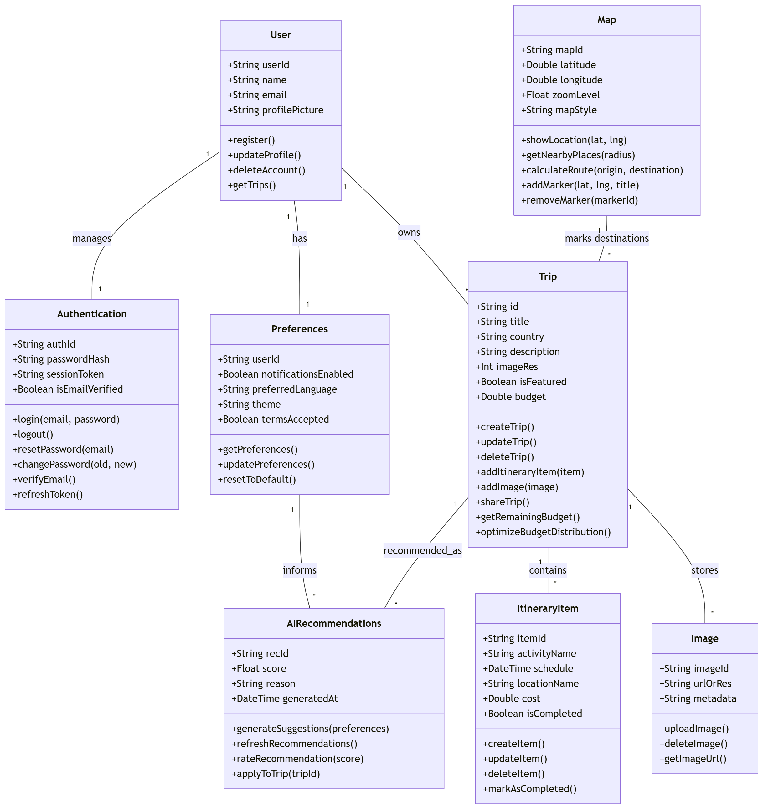

# 📐 Diseño Arquitectónico de Nomad

## 🏛️ Arquitectura General
Nomad sigue una arquitectura **MVVM (Model-View-ViewModel)** para una mejor separación de responsabilidades y escalabilidad.

## 📊 Modelo de Datos: Creado completo para futuros Sprints

El dominio de la aplicación se divide en módulos lógicos interconectados que representan las entidades principales del ecosistema de viajes.

### Entidades Principales
* **User & Authentication**: El `User` centraliza la identidad (nombre, email, foto) y se vincula 1:1 con `Authentication` para gestionar tokens de sesión y seguridad.
* **Trip (Viaje)**: La entidad núcleo que contiene detalles como `title`, `country`, `description` y `budget`. Posee métodos de lógica de negocio como `optimizeBudgetDistribution()`.
* **ItineraryItem (Paradas)**: Cada viaje contiene una lista de ítems (vuelos, hoteles, actividades) vinculados a un `ItineraryType` para su categorización.
* **Preferences**: Almacena la configuración del usuario, incluyendo el estado de `termsAccepted` y el idioma preferido.
* **AIRecommendations**: Sistema que consume las `Preferences` del usuario para generar sugerencias personalizadas de destinos y paradas.

---

## 🗄️ Persistencia de Datos (Database Schema)

Nomad utiliza **Room** para la persistencia local, lo que permite el funcionamiento offline y una gestión eficiente de los datos del usuario. La base de datos se denomina `nomad_database` (versión 2).

### Esquema de Tablas

| Tabla | Clave Primaria | Descripción |
| :--- | :--- | :--- |
| **`users`** | `id` (Firebase UID) | Perfil completo del usuario (email, username, birthdate, etc.). |
| **`trips`** | `id` (UUID) | Información general del viaje (destino, fechas, presupuesto). |
| **`itinerary_items`** | `id` (UUID) | Actividades específicas de un viaje (vuelos, hoteles, eventos). |
| **`access_logs`** | `id` (Auto-inc) | Historial de inicios y cierres de sesión (seguridad y auditoría). |

### Implementación y Acceso
* **DAOs**: Se definen interfaces para operaciones CRUD. `TripDao` e `ItineraryDao` devuelven `Flow<List<T>>` para permitir una UI reactiva que se actualiza automáticamente ante cambios en la DB.
* **Migrations**: Se utiliza `fallbackToDestructiveMigration()` durante la fase de desarrollo para simplificar cambios en el esquema.
* **Repositorios**: Actúan como una capa de abstracción entre los DAOs y los ViewModels, facilitando la posible integración futura con fuentes de datos remotas.

---

## 🎨 UI & Screens (Capa de Presentación)

### 1. Formulario de Viaje (`FormularioViaje`)
Esta pantalla gestiona la creación de un `Trip` mediante un proceso de pasos dinámicos.

* **Paso 1 (Detalles)**: Captura la información general utilizando `OutlinedTextField` y selectores de fecha (`DatePicker`) para ida y vuelta.
* **Paso 2 (Actividades)**: Permite visualizar y añadir `ItineraryItem` a la lista actual del viaje.
* **Navegación**: Utiliza `AnimatedContent` para transiciones fluidas entre las etapas del formulario.

### 2. Gestión de Itinerarios (`DialogoNuevaActividad`)
Componente modal que permite la entrada de datos para nuevas paradas.
* **Input de Tiempo**: Implementa `TimePicker` de Material 3 para definir el `schedule` de la actividad.
* **Categorización**: Un `DropdownMenu` permite seleccionar el tipo de actividad (Vuelo, Restaurante, Hotel, etc.), mapeándolo con `ItineraryType`.

---

## 🛠️ Tecnologías y Estándares

| Componente | Tecnología |
| :--- | :--- |
| **Framework UI** | Jetpack Compose (Declarativo) |
| **Diseño** | Material Design 3 (M3) |
| **Navegación** | Compose Navigation Recomended |
| **Persistencia Local** | Room Database |
| **Configuración** | SharedPreferences (para `terms_accepted`) |
| **Gestión de Estado** | `mutableStateOf` con `rememberSaveable` |

---
